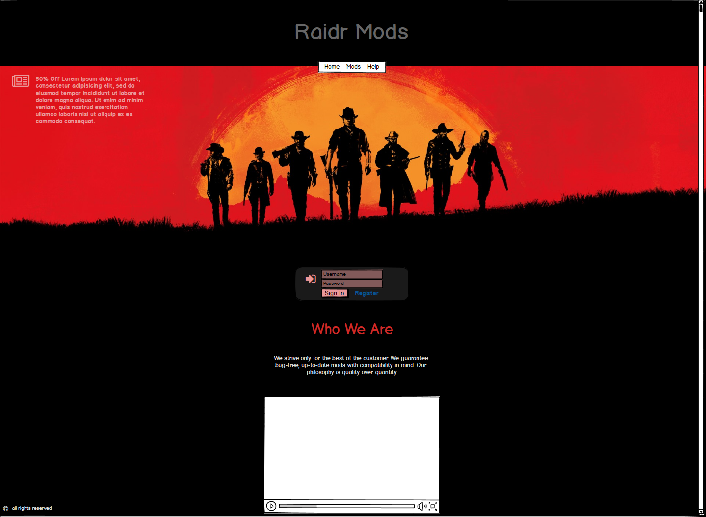
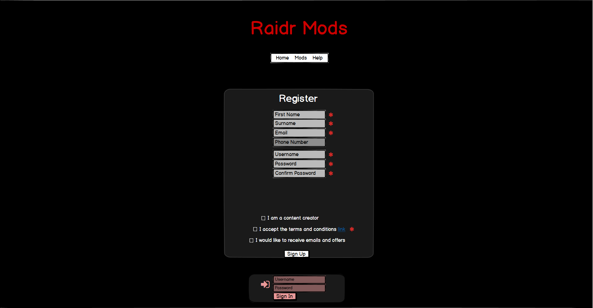
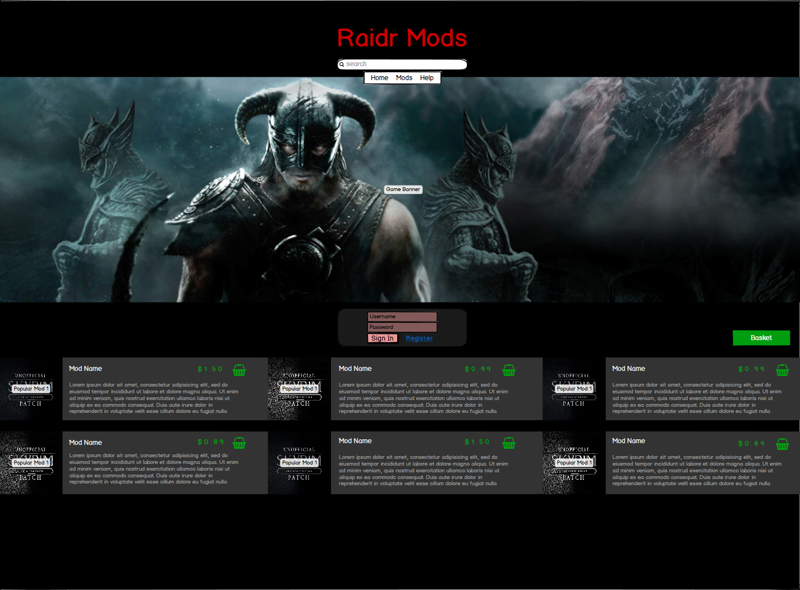
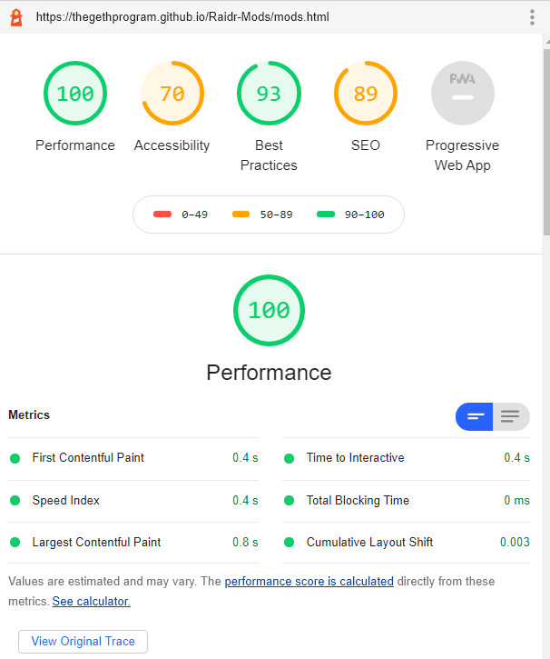
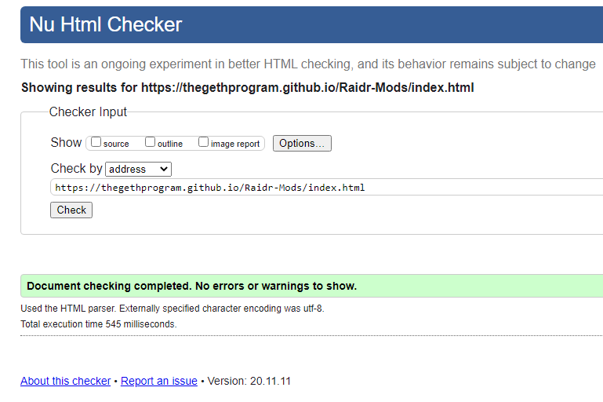
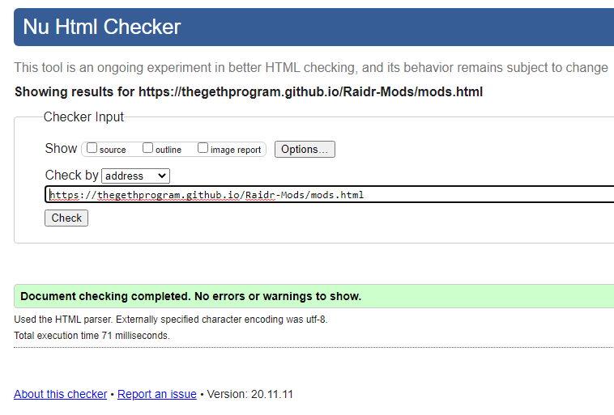
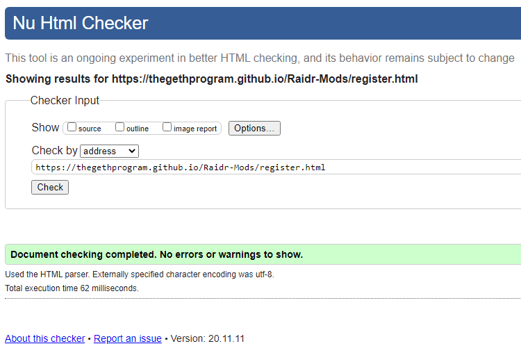
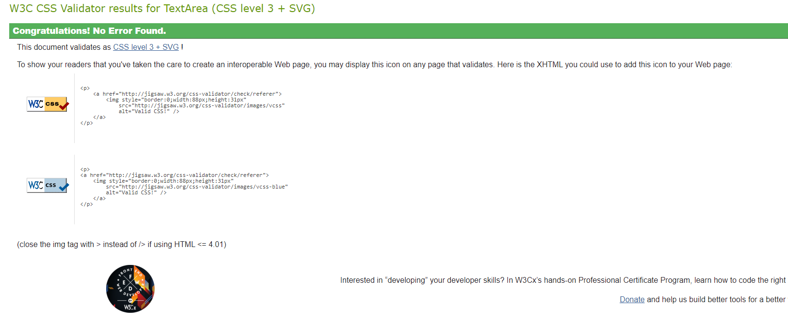
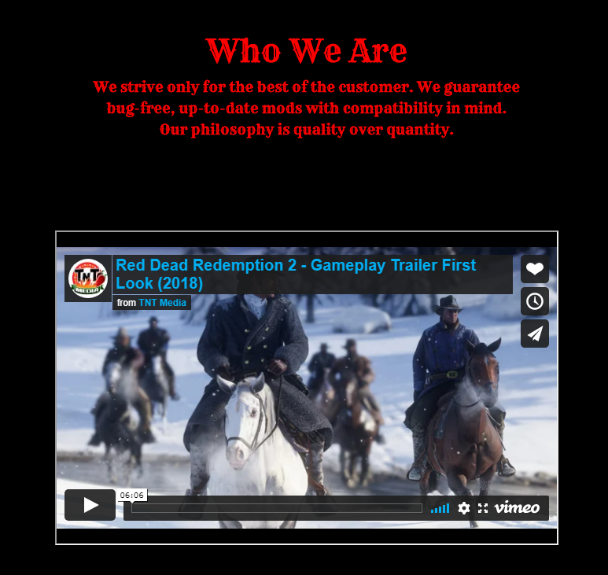

###### Aaron Thompson
https://thegethprogram.github.io/Raidr-Mods/index.html

# Raidr Mods

*[Please ignore README.html, txt css.css and txt html, they're for temp use only]*


This website is created with the intention of selling modifications (mods)
to gamers - the target audience for this site. Mods are downloadable modifications for your game that would 
traditionally be free. (Example: Texture replacement of a character's shirt.)
    
The goal for this website is to implement a system were mod creators can make
a profit, but must conform to a contract that requires a deadline and a bug-free 
product. Currently, B2C will not be willing to make a purchase because 
selling mods has been frowned upon for a long duration of time. There should be a 
video within the Home-Page explaining how this benefits the consumer. 

Many consumers within the gaming community can be disdainful with
regards to paid mods - and the market for paid mods is 
still relatively fresh. But the market is also lacking in terms of variety and quality.
This is where I hope to shift perceptions, 
and offer a service to consumers that is different and more accomodating to user needs. 
My product, my webiste, will give consumers a reason to pay for mods, by offering a service 
that aims to always be reliable, consumer-focused and valuable. But is also appeals to modders, the 
creators of mods, who scarcely have many means of making profit for their content. Thus, I appeal to
both the consumer wanting to purchase a reliable, high-quality mod, and also the creator,
who desires to earn something for all their hard work.
            
        

### Business goals include:
* B2C - Awareness of benefits
* Quality over Quantity
* Creator-Specific UI
* Site-Exlusive content
* Content creators


### Customer goals include:
* Trust in website (contact details, address, video)
* Clear pricing & Clear listing of games
* Reassurance that paying is beneficial
* High-Quality mods for their game
* Support & Installation Process
* Clear definition of products
* Get a good deal/Offer
* Finding a product
* Reviews

### Seller goals include:
* Making sales
* Finding the sellers fees
        
        
        

# UX/UI


    

## To compete against the competition this site will:

Have fully interactive and well-done features
Deliver a simple and intuitive design
Make life easier for the consumer
Showcase the most popular mods


## Features


**Home Page**
The homepage is simple.
            
            
It is paramount for the site's structure and design to be appropriate 
to the audience. It is unnecessary to overload my users with information or 
superfluous content - consumers come to this site for purchasing a product (a mod) 
and they would want to buy it quickly and effeciently so that they can get back to gaming.
Therefore, I have opted for a linear design, which is  simple and easy to understand;
suitable for users of all levels. This simple **user interface**, encourages users to draw their attention to the promotional video on the homepage,  which is there to reconcile the quarrelsome relationship between consumers and paid mods. The promotional offers in front of the **hero image** fulfills a similar purpose. It helps to reinforce the purpose of the site to the user, and may trigger a positive emotional response upon seeing an offer, which can encourage a purchase. The promotional offers' bold text is eye catching but without being too protuding to the user, thus it avoids distracting them from the site's main content. The **nav-bar** is small but catches the eye as it sits within the legend of the hero-image. The form includes transparency on a grey box to keep the user from visual overload.


**The Theme**
Rye font represents a more outlandish style, which focuses on the “outlaw” theme. This is to subconsciously tell 
the viewer that we are not corporate dominators but outlanders.


**Main Heading**
                
The name 'Raidr Mods' was originally of viking origin, inspired
by a fantasy game: The Elder Scrolls Skyrim, which is predominantly viking themed.
Skyrim has the most popular modding community and subconsciously tells the viewer that we have Skyrim mods without their conscious knowledge.

**Navbar**
The navbar is close to the center of the hero image and its individual nav links are spaced closely together, to emphasize a cleaner aesthetic. This was 
achieved by keeping the width of the navbar at least half the size of the main header, but also in sacrifice of spacing the navbar links, while also maintaining a large enough size for a navbar.

**Hero-Image**
I have chosen a Read Dead Redemption 2 image to subconsciously show the viewer that this is a high quality website - analogous to the game, which is a triple A game. This can also 
incite a positive emotional response in the viewer, as many gamers would have played this game and found it to be an emotional experience, which could provoke emotion-based purchases, or/and impulse buying. Most users may make a purchase on their first visit to a wesbite - by invoking an emotional repsonse, I hope to incite a similar repsponse and encourage more purchases by implementing good visual desgin.
                
**News**
The news has padding to keep the aesthetic clean, while also pushing it further into the center for the user to see more clearly. It is in white with no box around it to make it uncluttered, coherent and professional, while compelling the viewer to look and take notice of it. The black represents a link, and is made clear by its contrast to the white.

**Sign In**
I have used a more standard form to keep a white aesthetic, to promote the use of accounts. My plan is to remove the sign-in form once the user has logged in. The register link is also in-between both username and password to convey the importance of it, by keeping it centred. Sign-In may be improved at a later date, but also may be perfect the way it is.

**Introduction**
The introduction is lower on the page, trying not to force the user to read it, but also giving them a chance to scroll down and find a video there. As you may be able to tell, the introduction is somewhat teasing you to scroll down and find out if there is any more content.


## Register Page
The register page is simple and straightforward. All focus is 
 on the form box due to the contrasting background.
All that is required are highlighted, while "Phone Number"
has a lower opacity to signify lower importance. The form 
border also gives the user more focus on the form. Each input 
is silver to reduce eye strain from the page.


## Mod Store Page
The Mod Store Page consists of 3 columns and multiple rows. B2C 
will expect a good list of mods to gain inspiration and find mods
they never knew existed in order to spike intrigue. Mods will be  
sorted from most popular to least to improve UX. The color of the
"mod box" is a color that should keep visual overload to a minimum  
- this includes the text size and colour; plentiful information
with little sacrifice. Each mod has a price which the seller will 
set. An "add to basket" icon will make purchases more seemless.


## Game Page
The "Game Page" is simple and easy to understand. The games will be sorted 
by popularity. Each game will have a smaller scale when the user's cursor 
hover's over them, to make visual presentation more seemless.

### Accessibility
All appropriate images and videos have been given alt tags
    
### Main heading
* Linked to index.html
* Font: Rye
* Silver hover
        


### Navbar  
* Home
* Mods
* Help
            


### News
            
* Newspaper icon        
* Hero image
* Form         
* Form box
* Icon
* Username input
* Password input
* Sign-in button
* Register link
* Promotional video with intro description
* Footer
    
    

### Mod Page
        
* Search Bar
* Hero-Image 2
* Basket
* Mods for sale          
* Add to basket icon/Checkout
* Product price
* Product image
* Mod description
* Mod title
                
        
        
### Register Page
        
* Register Form w Border
* x3 Checkbox
* Sign-In

        
### UX Revisit
            
Implement javascript features when I have learned more about it
Expand on this update's plan
            
Content Creator Update
Content Creator update shall implement:
        
A checkbox under registration "Content Creator"
A seperate page dedicated for content creators [alternate index.html]
which will include an upload button and "My mods" within a dropdown menu under "MODS" within the navbar navbar
            
        
### Help Page
        
* Implement contact details, location, address
* Create a wireframe for the Help Page
        

* Mod Page for each game


## Wireframes






## Testing
### Automated testing
W3C Markup Validation &  W3C CSS Validation

Lighthouse [Chrome Performance]


W3C HTML




W3C CSS


## Testing User Stories
* **As a user, I want to know what the site is for**
I haven't stated exactly what the site is for, due to it being for a very specific audience. Somewhat like Nexusmods.com; Mods are downloaded from here with billions of downloads. The user will have to know already what "mods" are. I will impletement a Help page in the future, to answer questions like "What are mods?" and FAQ.

* **As a user, I want to know why I would pay for mods when I could just get them for free on other sites**
On index.html, I have tried to reconsile the user with paid mods, through the use of the introduction, just above the video. The video will be replaced with an introductory video; Informing the user what the site is about.



* **As a user, I want to be able to navigate with ease**
I've index.html not too large of a page, and there is a very small amount of content currently, which currently has ease. In future, the page will be designed with content and ease in mind.


### Further Testing

* The Website was tested on Google Chrome, Internet Explorer, Microsoft Edge and Safari browsers
* The website was viewed on a variety of devices such as Desktop, Laptop, Xperia Z3+, Honor 20 Pro
* Tested mobile responsiveness with Chrome Devtools - Works as expected
* Has suitable Mobile/UX Design
* Users can input data in the register form - Form does not have functionality currently - Which will be expanded upon in the future.
* All navlink buttons and anchor tags work correctly
* Friends and family members were asked to review the site and documentation to point out any bugs and/or user experience issues.

### Known Bugs
* On register.html the form container does not fill the entire viewport (height) for mobile devices.
* On register.html the first checkboxes does not always respond correctly to user input.


## Deployment

### GitHub Pages

The project was deployed to GitHub Pages using the following steps...

1. Log in to GitHub and locate the [GitHub Repository](https://github.com/)
2. At the top of the Repository (not top of page), locate the "Settings" Button on the menu.
    - Alternatively Click [Here](https://raw.githubusercontent.com/) for a GIF demonstrating the process starting from Step 2.
3. Scroll down the Settings page until you locate the "GitHub Pages" Section.
4. Under "Source", click the dropdown called "None" and select "Master Branch".
5. The page will automatically refresh.
6. Scroll back down through the page to locate the now published site [link](https://github.com) in the "GitHub Pages" section.

### Forking the GitHub Repository

By forking the GitHub Repository we make a copy of the original repository on our GitHub account to view and/or make changes without affecting the original repository by using the following steps...

1. Log in to GitHub and locate the [GitHub Repository](https://github.com/)
2. At the top of the Repository (not top of page) just above the "Settings" Button on the menu, locate the "Fork" Button.
3. You should now have a copy of the original repository in your GitHub account.

### Making a Local Clone

1. Log in to GitHub and locate the [GitHub Repository](https://github.com/)
2. Under the repository name, click "Clone or download".
3. To clone the repository using HTTPS, under "Clone with HTTPS", copy the link.
4. Open Git Bash
5. Change the current working directory to the location where you want the cloned directory to be made.
6. Type `git clone`, and then paste the URL you copied in Step 3.

```
$ git clone https://github.com/YOUR-USERNAME/YOUR-REPOSITORY
```

7. Press Enter. Your local clone will be created.

```
$ git clone https://github.com/YOUR-USERNAME/YOUR-REPOSITORY
> Cloning into `CI-Clone`...
> remote: Counting objects: 10, done.
> remote: Compressing objects: 100% (8/8), done.
> remove: Total 10 (delta 1), reused 10 (delta 1)
> Unpacking objects: 100% (10/10), done.
```

## Attributions
https://www.w3schools.com/
https://www.reddit.com/
https://stackoverflow.com/
https://www.codecademy.com/
https://www.freecodecamp.org/
https://app.slack.com/client/T0L30B202/D017WCNDCBS (codeinstitute students/tutors)
Code-Institute Tutor Support